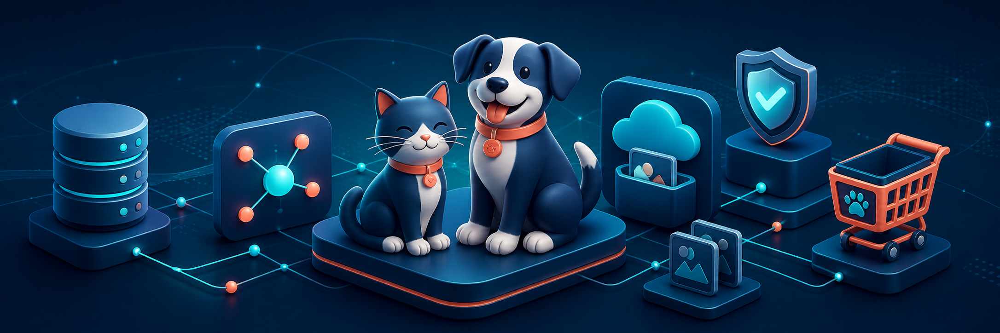
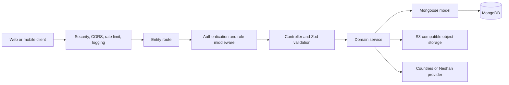
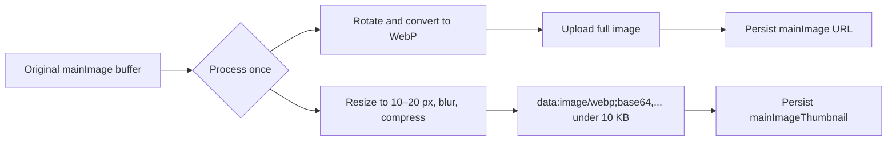

# Pet Shop Backend API



A production-oriented REST API for a pet-commerce platform. It manages users, pets, products, taxonomy, carts, wishlists, orders, locations, image uploads, and external reference-data integrations through a layered Express and MongoDB architecture.

The project is useful as:

- The backend for a pet shop web or mobile application.
- A catalog and inventory service for pets and pet products.
- A reference implementation of an Express 5 and Mongoose application with clear entity boundaries.
- A starting point for projects that need authentication, role-based access, carts, order snapshots, image storage, validation, and OpenAPI documentation.

## Main capabilities

- User registration, login, JWT access/refresh tokens, password changes, profiles, addresses, and account administration.
- Role-based access control for `admin`, `seller`, and `customer` users.
- Pet and product catalogs with search, filters, pagination, enable/disable workflows, pricing, discounts, stock, and taxonomy relationships.
- Pet types and breeds, plus product categories and subcategories.
- Polymorphic carts and wishlists that can contain either Products or Pets.
- Immutable Order snapshots created from finalized carts, with management delivery and shipping updates.
- Multipart image uploads backed by S3-compatible Arvan Object Storage.
- Automatic WebP conversion and blurred Base64 LQIP generation for Product and Pet `mainImageThumbnail` fields.
- Iranian province/city lookup, cached country data, and authenticated Neshan reverse geocoding.
- Persian application and validation messages.
- Security headers, CORS, rate limiting, structured request logging, and centralized error handling.
- Generated OpenAPI 3.0 contract with an interactive Scalar API reference.
- Colocated unit and integration tests for domain entities and shared infrastructure.

## Architecture

Requests move through thin HTTP layers into domain services. Controllers validate and orchestrate requests, services own business logic, and models own persistence rules.



Normal entity flow:

```text
src/app.js
  → global middleware
  → entity route
  → controller
  → service
  → model or integration client
```

### Product and Pet image flow

Product and Pet create endpoints accept `multipart/form-data`. The client uploads `mainImage`; the backend owns image URL and placeholder generation.



When an image is replaced, both values are updated together. A non-image update preserves the existing placeholder. Failed persistence triggers cleanup of the newly uploaded object, while a successful replacement removes the previous object.

## Project structure

```text
pet_shop-backend-app/
├── docs/                         Cross-project documentation and assets
├── src/
│   ├── __tests__/                Shared integration-test setup and API-doc tests
│   ├── configs/                  Environment, MongoDB, storage, constants, Zod, OpenAPI
│   ├── entities/                 Business domains
│   │   ├── users/                Accounts, auth, profiles, addresses, cart, wishlist
│   │   ├── petTypes/             Pet type definitions
│   │   ├── breeds/               Breeds associated with pet types
│   │   ├── pets/                 Pet catalog
│   │   ├── categories/           Product categories
│   │   ├── subCategories/        Category-owned subdivisions
│   │   ├── products/             Product catalog
│   │   └── orders/               Immutable purchase snapshots
│   ├── integrations/
│   │   ├── countries/            Cached remote country data
│   │   ├── locations/            MongoDB-backed provinces and cities
│   │   └── reverseGeocoding/     Neshan coordinate-to-address adapter
│   ├── middlewares/              Auth, roles, security, uploads, logging, errors
│   ├── services/                 Shared object-storage and main-image workflows
│   ├── utils/                    Responses, pagination, JWT, paths, image processing
│   ├── app.js                    Express composition root
│   └── server.js                 Database connection and HTTP lifecycle
├── package.json
└── README.md
```

Each business entity follows the same local structure:

```text
<entity>.model.js             Persistence schema, indexes, database validation
<entity>.service.js           Business rules and database operations
<entity>.controller.js        Request validation and response orchestration
<entity>.route.js             Endpoints and middleware composition
<entity>.schema.js            Zod request and model schemas
<entity>.helpers.js           Optional pure entity-specific helpers
<entity>.unit.test.js         Isolated service tests
<entity>.integration.test.js  HTTP, middleware, controller, and persistence tests
```

## Technologies

| Area             | Technology                             | Purpose                                                       |
| ---------------- | -------------------------------------- | ------------------------------------------------------------- |
| Runtime          | Node.js, ECMAScript modules            | Application runtime and module system                         |
| HTTP             | Express 5                              | REST routes and middleware composition                        |
| Database         | MongoDB, Mongoose 9                    | Documents, relationships, indexes, and validation hooks       |
| Validation       | Zod 4                                  | Request and model-data validation with Persian error mapping  |
| Authentication   | JSON Web Token, bcryptjs               | Access/refresh tokens and password hashing                    |
| Object storage   | AWS SDK S3 client                      | Arvan S3-compatible image upload and cleanup                  |
| Image processing | Sharp                                  | WebP conversion, compression, blur placeholders, and rotation |
| File uploads     | Multer                                 | In-memory multipart image uploads and limits                  |
| API reference    | OpenAPI 3, Scalar, swagger-autogen     | Machine-readable contract and interactive documentation       |
| Security         | Helmet, CORS, express-rate-limit       | HTTP hardening and request throttling                         |
| Logging          | Pino, pino-http, pino-pretty           | Structured application and request logs                       |
| Testing          | Jest, Supertest, mongodb-memory-server | Unit and integration testing                                  |
| Code quality     | ESLint, Prettier, Husky                | Linting, formatting, and Git hooks                            |

### Important packages

- `mongoose`: MongoDB schemas, queries, population, hooks, and indexes.
- `zod`: input validation and Persian validation-message mapping.
- `jsonwebtoken` and `bcryptjs`: authentication and password security.
- `@aws-sdk/client-s3`: uploads, replacements, and deletions in object storage.
- `sharp`: validates and converts uploaded images and generates WebP LQIPs.
- `multer`: accepts avatar and catalog image buffers through multipart requests.
- `nanoid`: generates storage object keys and order identifiers.
- `nodemailer`: email-delivery support.
- `pino`: structured application logging.
- `@scalar/express-api-reference`: interactive API documentation at `/docs`.

## Getting started

### Prerequisites

- Node.js 20 or newer.
- npm.
- A MongoDB instance.
- An S3-compatible Arvan Object Storage bucket for image features.
- A Neshan API key if reverse geocoding is required.

### Installation

```bash
git clone <repository-url>
cd pet_shop-backend-app
npm install
```

Create a `.env` file in the repository root:

```dotenv
NODE_ENV=development
PORT=3000

MONGODB_URI=mongodb://localhost:27017/pet_shop_db
MONGODB_TEST_URI=mongodb://localhost:27017/pet_shop_test_db

JWT_SECRET_KEY=replace-with-a-long-random-secret

ARVAN_ENDPOINT=https://s3.ir-thr-at1.arvanstorage.ir
ARVAN_ACCESS_KEY=your-access-key
ARVAN_SECRET_KEY=your-secret-key
ARVAN_BUCKET=your-bucket-name
ARVAN_PUBLIC_BASE_URL=https://your-public-cdn.example.com

NESHAN_API_KEY=your-neshan-api-key
MELIPAYAMAK_OTP_TOKEN=your-melipayamak-otp-token
COUNTRIES_API_URL=https://www.apicountries.com/countries

LOG_LEVEL=info
```

`ARVAN_PUBLIC_BASE_URL` and `COUNTRIES_API_URL` are optional overrides. Keep secrets outside source control.

### Run locally

```bash
npm run dev
```

The default server address is `http://localhost:3000`.

## API documentation

After starting the server:

- Interactive Scalar reference: [http://localhost:3000/docs](http://localhost:3000/docs)
- OpenAPI JSON: [http://localhost:3000/openapi.json](http://localhost:3000/openapi.json)
- API base path: `http://localhost:3000/api`

Regenerate the contract after changing routes, schemas, authorization, responses, or status codes:

```bash
npm run openapi
```

## API domains

| Domain                       | Responsibility                                                                     |
| ---------------------------- | ---------------------------------------------------------------------------------- |
| Users                        | Registration, login, token refresh, profiles, passwords, addresses, administration |
| Cart and wishlist            | Product/Pet selection, quantities, calculated totals, checkout metadata            |
| Orders                       | Historical cart snapshots, user history, management delivery workflow              |
| Products                     | Customer and management catalog views, stock, pricing, taxonomy, images            |
| Pets                         | Customer and management catalog views, breed/type relations, pricing, images       |
| Categories and subcategories | Product taxonomy                                                                   |
| Pet types and breeds         | Pet taxonomy                                                                       |
| Countries                    | Normalized and cached remote country data                                          |
| Locations                    | Iranian province and city reference data                                           |
| Reverse geocoding            | Authenticated Neshan coordinate lookup                                             |

Consult `/docs` for the authoritative routes, request bodies, authentication requirements, statuses, and response schemas.

## Authentication and authorization

Protected routes expect a bearer access token:

```http
Authorization: Bearer <access-token>
```

Roles are applied at the route layer:

- `customer`: personal profile, addresses, cart, wishlist, orders, and customer catalog access.
- `seller`: catalog management and supported order-management operations.
- `admin`: full management access, including restricted deletion and user administration.

## Available scripts

| Command                    | Description                                                 |
| -------------------------- | ----------------------------------------------------------- |
| `npm run dev`              | Format, lint, and start the development server with Nodemon |
| `npm start`                | Format, lint, and start the production server               |
| `npm test`                 | Run the complete Jest suite serially                        |
| `npm run test:unit`        | Run unit tests                                              |
| `npm run test:integration` | Run integration tests                                       |
| `npm run test:coverage`    | Generate Jest coverage                                      |
| `npm run test:watch`       | Run Jest in watch mode                                      |
| `npm run lint`             | Run ESLint with automatic fixes                             |
| `npm run format`           | Format JavaScript, JSON, and Markdown with Prettier         |
| `npm run openapi`          | Regenerate `src/configs/openapi.json`                       |

## Testing approach

- Service unit tests mock persistence and external providers.
- Entity integration tests exercise routes, middleware, controllers, validation, and MongoDB behavior.
- Storage tests mock the S3 client and never require live network access.
- API documentation tests verify both `/openapi.json` and `/docs`.
- Shared helper tests cover image conversion, Base64 placeholder limits, validation mapping, and middleware behavior.

Run the standard quality checks before submitting changes:

```bash
npm run lint
npm test
npm run openapi
```

## Design conventions

- Business logic belongs in services, not controllers.
- Controllers validate and orchestrate HTTP requests.
- Public image fields persist complete bucket URLs; only tiny blur placeholders use Base64.
- Stable roles, statuses, limits, error codes, and image settings live in shared constants.
- New application messages are written in Persian.
- Public API changes must update and regenerate the OpenAPI contract.
- Module aliases such as `#entities/*`, `#services/*`, and `#utils/*` avoid deep relative imports.

## License

This project is distributed under the ISC license declared in `package.json`.
